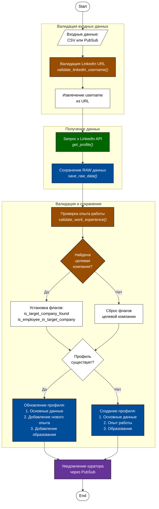
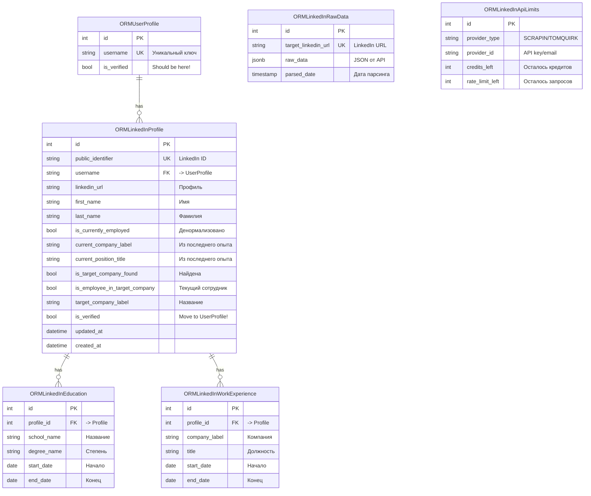
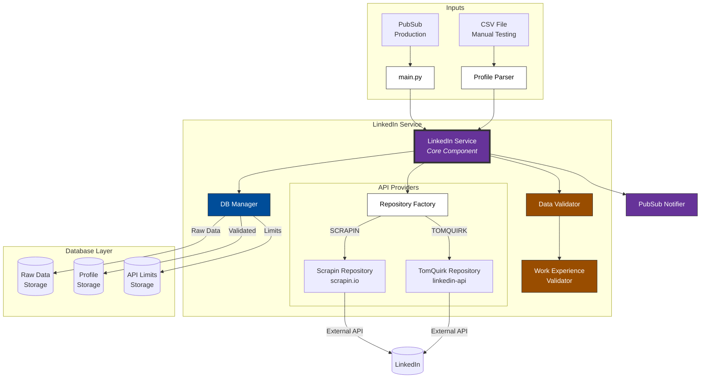
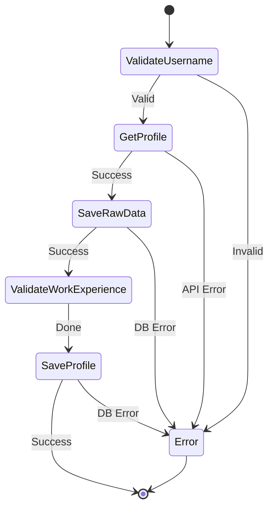
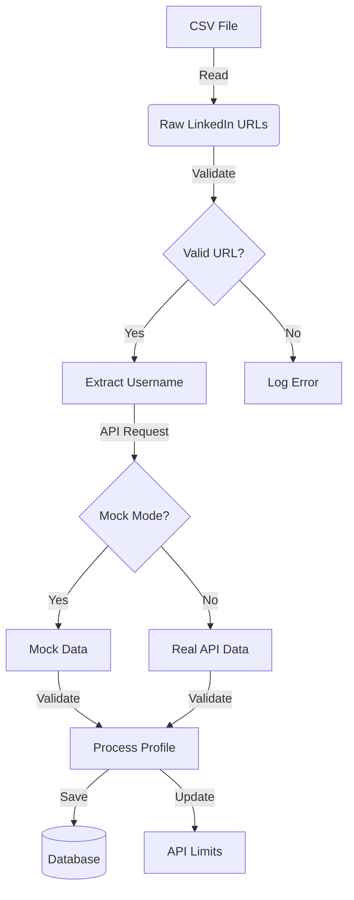
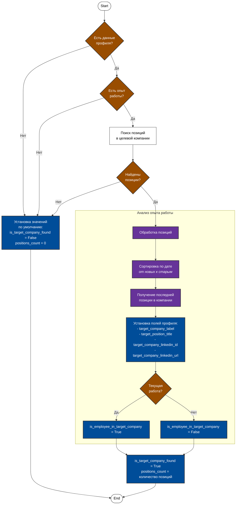

# Диаграммы LinkedIn Verifier Service

Для визуализации диаграмм используйте [Mermaid Live Editor](https://mermaid.live/)

## Процесс обработки профилей



## Структура базы данных



## Архитектура сервиса



## Процесс валидации профиля



## Поток данных



## Как использовать диаграммы

1. Скопируйте код диаграммы между тегами ` ```mermaid ` и ` ``` `
2. Вставьте в [Mermaid Live Editor](https://mermaid.live/)
3. Редактируйте и экспортируйте по необходимости

## Дополнительные ресурсы

- [Документация Mermaid](https://mermaid.js.org/intro/)
- [Примеры диаграмм](https://mermaid.js.org/syntax/examples.html)

## Процесс валидации опыта работы



%% Примечания:
%% 1. Поиск позиций в целевой компании учитывает регистр (toLowerCase)
%% 2. Сортировка использует безопасную дату для null значений (1900-01-01)
%% 3. Все изменения полей профиля происходят в памяти до сохранения в БД 